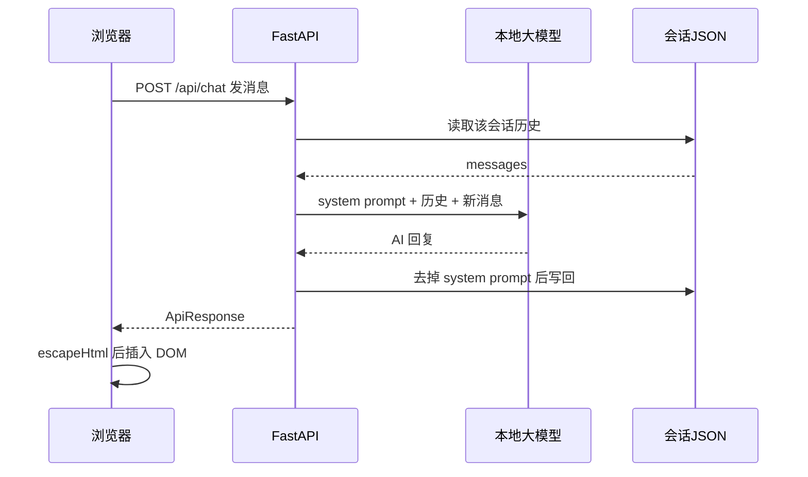

# 01. 学习路线总览

这份笔记来自一段集中的 Python 学习：**9 月 18 日到 9 月 29 日，12 天、6 个章节**。路线是从语法基础出发，依次经过面向对象、AI 应用、网络机器人、数据分析，最后落到 FastAPI 后端开发，中间穿插了 4 个非练习性质的实战项目。

| 日期 | 章节 | 主题 | 主要产出 |
| --- | --- | --- | --- |
| 09-18 | 第1章 | 变量、类型、运算符、`match-case` | 环境与语法热身 |
| 09-19 | 第1章 | 数据容器马拉松：列表 → 字符串 → 元组 → 集合 → 字典 → 函数 | 容器对比表 |
| 09-20 | 第1章 / 第2章 | 函数进阶（lambda、函数作为参数）、模块与包；类与异常 | — |
| 09-21 | 第3章 | Streamlit 入门、大模型 API 调用 | 聊天机器人 v1 |
| 09-22 | 第3章 | 文件读写、机器人迭代 v2 / v3 / v4 | **AI 智能伴侣**（4 个版本） |
| 09-23 | 第4章 | requests + XPath、CSV、正则表达式 | **TMDB 电影榜单网络机器人** |
| 09-27 | 第4章 | 回看网络机器人脚本，重跑数据 | `movies.csv`（27 部电影） |
| 09-28 | 第5章 | Jupyter、Pandas、Matplotlib，共 8 个 Notebook | **销售数据分析 + 图表** |
| 09-29 | 第6章 | 面向对象高级（封装 / 继承 / 多继承 / 多态 / 鸭子类型）、FastAPI 入门 | **汉字谜盒**（AI 猜字谜游戏） |

四个实战项目分别是：第 3 章的 **AI 智能伴侣**（Streamlit + 大模型，迭代 4 版）、第 4 章的 **TMDB 电影榜单网络机器人**、第 5 章的 **销售数据分析**、第 6 章的 **汉字谜盒**（FastAPI + 原生前端）。下面按章节记录知识点。

# 02. 基础语法与数据容器

## 2.1 变量、类型与运算符

用 `type()` 与 `isinstance()` 判断类型，注意 `bool` 是 `int` 的子类，所以 `isinstance(num, int)` 对布尔值也成立：

```python
num = 10
print(type(num))
# 判断num是否是int类型的实例
print(isinstance(num, int))
print(isinstance(num, float))
print(isinstance(num, bool))
```

**除法的三种写法**是最容易搞混的地方，注释里记下了区别：

```python
print(10 ** 2) # n**m 表示n的m次方
print(10 / 2) # 除法，返回浮点数商
print(10 // 2) # 整除，返回商的整数部分
print(10 % 2) # 取余，返回除法的余数
```

## 2.2 match-case 模式匹配

`match-case` 是 Python 3.10 才有的语法。案例是"输入数字输出星期"，重点有两个：用 `while True` + `try/except ValueError` 做输入校验，以及 `case 6 | 7` 的**多值匹配**和 `case _` 的**兜底分支**：

```python
while True:
    try:
        day = int(input("请输入一个日期(1-7)："))
        break
    except ValueError:
        print("请输入一个整数")
        continue
match day:
    case 1: print("星期一")
    case 2: print("星期二")
    case 3: print("星期三")
    case 4: print("星期四")
    case 5: print("星期五")
    case 6 | 7: print("周末")
    case _: print("输入错误")
```

## 2.3 序列切片与列表推导式

切片的完整语法是 `序列[起始:结束:步长]`，三个参数都可以省略：起始默认 0、结束默认到末尾、步长默认 1。**步长为负数时可以把序列反转**：

```python
print(s[0:5:2])   # [114, 108, 78]
print(s[::-1])    # [75, 78, 23, "ABC", 114]  反转
```

列表推导式可以在写循环的同时做条件过滤，语法是 `[要插入列表的数据 for 变量 in 可迭代对象 if 条件]`：

```python
list2 = [num ** 2 for num in list1 if num % 2 == 0]
```

合并两个列表用星号解包，去重则借道集合（`set` 不保证顺序，所以去重后要重新 `sort()`）：

```python
num_list3 = [*num_list1, *num_list2]
num_list3 = list(set(num_list3))
num_list3.sort()
```

## 2.4 数据容器五兄弟对比

这张对比表是第一章最有价值的总结，把 str / list / tuple / set / dict 放在一起横向比较，选择容器时照着查即可：

| 特性     | 字符串(str) | 列表(list)         | 元组(tuple)  | 集合(set)    | 字典(dict) |
| -------- | ----------- | ------------------ | ------------ | ------------ | ---------- |
| 有序性   | 有序        | 有序               | 有序         | 无序         | 有序(3.7+) |
| 重复元素 | 允许        | 允许               | 允许         | 不允许       | key不允许  |
| 可变性   | 不可变      | 可变               | 不可变       | 可变         | 可变       |
| 索引访问 | 支持        | 支持               | 支持         | 不支持       | 不支持     |
| 切片操作 | 支持        | 支持               | 支持         | 不支持       | 不支持     |
| 使用场景 | 文本处理    | 有序可重复数据集合 | 固定数据记录 | 去重数据集合 | 键值对     |

按容器记几个高频操作：

| 容器 | 常用操作 |
| --- | --- |
| 列表 list | `append` / `insert` / `remove` / `pop` / `sort` / `reverse` |
| 元组 tuple | `count` / `index` / `in` / `len`，不可修改元素 |
| 集合 set | `add` / `remove` / `pop` / `clear` / `difference` / `union` / `intersection` |
| 字典 dict | `get` / `[]` / `keys` / `values` / `items` / `del` / `pop` |

元组的**星号扩展解包**值得单独记：一个 `*` 变量负责吸收中间的所有元素，得到列表：

```python
t2 = 5, 7, 9, 1
x, *y, z = t2  # x=5, y=[7, 9], z=1
*s, o = t2     # s=5, o=[7, 9, 1]
```

## 2.5 函数进阶

函数部分从基础签名一路练到"函数作为参数"。`area_circle` 用了 `:param:` / `:return:` 风格的 docstring：

```python
def area_circle(r):
    """
    计算圆的面积
    :param r: 圆的半径
    :return: 圆的面积
    """
    area = math.pi * r ** 2
    return round(area, 2)
```

`*args` 收集位置参数、`**kwargs` 收集关键字参数，常用于写"参数数量不确定"的工具函数：

```python
def sum_data(*args, **kwargs):
    total = 0
    for num in args:
        total += num
    if 'round' in kwargs:
        total = round(total, kwargs['round'])
    return total

print(sum_data(2.1132, 3.2123, 4.13233, round = 2))  # 可变参数 + 关键字参数
```

**把函数当作参数传递**时，用 `Callable` 做类型标注。这里同时演示了 `lambda`：匿名函数适合这种"用完即弃、只传一次"的场景。

```python
from collections.abc import Callable

def add(x: int | float, y: int | float) -> int | float:
    return x + y

# 匿名函数
subtract = lambda x, y: x - y

def fun(x: int | float, y: int | float, func: Callable[[int | float, int | float], int | float]) -> int | float:
    return func(x, y)

result = fun(10, 20, add)       # 20
result = fun(10, 20, subtract)  # -10
```

最后是 Python 的入口惯例。模块被直接运行时 `__name__` 是 `'__main__'`，被导入时是模块名，所以下面这行可以保证 `main()` 只在直接执行时跑：

```python
if __name__ == '__main__':
    main()
```

## 2.6 模块与包

包的本质是带 `__init__.py` 的目录。`__init__.py` 里写 `from . import mod1` 可以让 `import mod` 之后直接访问 `mod.mod1`，`__all__` 则限定了 `from mod import *` 时暴露的成员：

```python
# 导入子模块，保证 import mod 后可直接使用 mod.mod1
from . import mod1

# 通配符导入（from mod import *）时暴露的成员
__all__ = ['mod1']
```

# 03. 面向对象与异常处理

## 3.1 类与对象

用一个 `Car` 类串起面向对象的核心概念：`wheel = 4` 是**类属性**（所有实例共享），`__init__` 里赋的是**实例属性**，`total_cost` 演示了带默认值的参数：

```python
class Car:
    wheel = 4
    def __init__(self, brand, name, price):
        self.brand = brand
        self.name = name
        self.price = price

    def running(self):
        print(f'{self.brand} {self.name} is running')

    def total_cost(self, discount, rate = 0.1):
        return self.price * (discount + rate)
```

`car1.__dict__` 可以一次性把对象的实例属性打印成字典，调试时很好用：

```python
car1 = Car('BMW', 'X5', 1500)
print(car1.__dict__)  # 将对象中的所有属性以字典的形式输出
# {'brand': 'BMW', 'name': 'X5', 'price': 1500}
```

## 3.2 魔法方法

魔法方法（dunder method）是"让自定义对象表现得像内置类型"的钩子。重写 `__str__` 决定 `print(obj)` 输出什么，重写 `__eq__` 决定 `==` 怎么比较：

```python
    def __str__(self):
        return f'{self.brand} {self.name} {self.price}'

    def __eq__(self, other):
        return self.brand == other.brand and self.name == other.name and self.price == other.price
```

常用魔法方法清单，按用途分三类：

| 魔法方法 | 作用 |
| --- | --- |
| `__init__` | 初始化方法，创建实例时调用 |
| `__str__` | 将对象转换为字符串，影响 `print` / `str()` |
| `__eq__` | 比较两个对象是否相等，影响 `==` |
| `__lt__` / `__le__` | 小于 / 小于等于，影响 `<` `<=` |
| `__gt__` / `__ge__` | 大于 / 大于等于，影响 `>` `>=` |

## 3.3 异常处理

`try/except/finally` 的结构：按**具体异常类型**从上往下匹配，末尾用 `except Exception as e` 兜底，`finally` 无论是否异常都会执行。注释里预留了三种可触发异常的语句，方便反复验证：

```python
try:
    print("=" * 10)
    # print(my_name)
    # print(1 / 0)
    # print("ABC"[10])
    print("ABC".hello)
    print("=" * 10)
except NameError as e:
    print("变量未定义", e)
except ZeroDivisionError as e:
    print("除数不能为0", e)
except IndexError as e:
    print("索引超出范围", e)
except Exception as e:
    print("其他异常", e)
finally:
    print("finally")
```

# 04. AI 实战：Streamlit + 大模型聊天机器人

这是第一个完整的项目——**AI 智能伴侣**：一个 Streamlit 网页聊天界面，背后调用 OpenAI 兼容接口的大模型，从"能跑"一路迭代到"像个工程"，共 4 个版本。

## 4.1 调用大模型

`openai` 这个 SDK 并不只服务 OpenAI，只要对方实现了兼容协议，改 `base_url` 就能接。先直连 DeepSeek 云 API 做验证：

```python
from openai import OpenAI

client = OpenAI(
    api_key="<>",
    base_url="https://api.deepseek.com")

response = client.chat.completions.create(
    model="deepseek-flash",
    messages=[
        {"role": "system", "content": "You are a helpful assistant"},
        {"role": "user", "content": "Hello"},
    ],
    stream=False,
    reasoning_effort="high",
    extra_body={"thinking": {"type": "enabled"}}
)

print(response.choices[0].message.content)
```

`messages` 里的 `system` 角色用来设定人设，`user` / `assistant` 交替构成对话历史——这个结构贯穿了整个项目。后来为了省调用成本，把 `base_url` 换成了本地服务（`http://192.168.64.1:1234/v1`）。

## 4.2 Streamlit 常用组件

Streamlit 的特点是**不用写前端**，脚本从上往下执行就是页面。一次性把常用组件练了个遍：

```python
import streamlit as st

st.set_page_config(page_title="Ex-stream-ly Cool App", page_icon="🧊", layout="centered")

st.header("这是一个标题")
st.subheader("这是一个子标题")
st.write("这是一个段落")

# 表格
data = {"姓名": ["张三", "李四", "王五"], "年龄": [18, 20, 22], "性别": ["男", "女", "男"]}
st.table(data)

# 输入框 / 密码框
name = st.text_input("请输入姓名")
password = st.text_input("请输入密码", type="password")

# 单选框 / 下拉选择框 / 多选框
gender = st.radio("请选择性别", ["男", "女"])
city = st.selectbox("请选择城市", ["北京", "上海", "广州"])
hobby = st.multiselect("请选择您的爱好", ["篮球", "足球", "跑步"])
```

顺带补了文件读写与 JSON，为后面的会话持久化做准备：

```python
import json

# 读文件
f = open("resources/example_txt2.json", "r", encoding="utf-8")
obj = json.loads(f.read())
f.close()

# 写文件
with open("resources/example_txt2.json", "w", encoding="utf-8") as f:
    messages = [
        {"role": "user", "content": "你好"},
        {"role": "assistant", "content": "你好，我是AI智能助手"},
    ]
    f.write(json.dumps(messages, ensure_ascii=False, indent=2))
```

## 4.3 四个版本的迭代

| 版本 | 新增能力 | 关键改动 |
| --- | --- | --- |
| v1 | 能聊天 | `st.session_state.messages` 保存对话，`st.chat_input` 收输入，`st.chat_message` 回显 |
| v2 | 流式输出（打字机效果） | `stream=True`，遍历 `chunk.choices[0].delta.content` 增量渲染 |
| v3 | 侧边栏控制面板 + 会话持久化 | 可自定义昵称与性格，会话存 `sessions/*.json`，终端彩色日志 |
| v4 | 工程化重构 | 常量抽取、类型标注、`pathlib`、按职责拆函数、`main()` 入口 |

v1 的核心是 `session_state`——Streamlit 每次交互都会重跑整个脚本，用 `session_state` 才能让对话历史活下来：

```python
# 初始化聊天消息
if "messages" not in st.session_state:
    st.session_state.messages = []

# 显示聊天消息
for message in st.session_state.messages:
    st.chat_message(message["role"]).write(message["content"])
```

v2 把 `stream=False` 改成 `stream=True`，模型返回的内容会一小块一小块地到达。用 `st.empty()` 占位，每收到一块就整体重写一次，视觉上就是逐字打印：

```python
response_placeholder = st.empty()
full_content = ""
for chunk in response:
    if chunk.choices[0].delta.content:
        full_content += chunk.choices[0].delta.content
        response_placeholder.chat_message("assistant").write(full_content)
st.session_state.messages.append({"role": "assistant", "content": full_content})
```

v3 加了侧边栏控制面板：人设不再写死在代码里，而是拼进 system prompt 模板，配合 `sessions/*.json` 做会话的增删查：

```python
system_prompt = """
        你叫%s，现在是用户的真实伴侣，请完全代入伴侣角色。：
        规则：
            1. 每次只回1条消息
            2. 禁止任何场景或状态描述性文字
            ...
        伴侣性格：
            - %s
    """

response = client.chat.completions.create(
    model="smegmma-deluxe-9b-v1",
    messages=[
        {"role": "system", "content": system_prompt % (
            st.session_state.new_partner_name,
            st.session_state.new_character_description
        )},
        *st.session_state.messages,
    ],
    stream=True,
)
```

v4 是**同一个功能的重写**，不新增特性，只把代码整形。这一版的价值在于看清"能跑"和"工程"之间差什么：

```python
"""AI 智能伴侣（Streamlit + OpenAI 兼容接口）。

规范化要点：
- 统一命名风格（snake_case）并补充类型标注、函数级注释；
- 将路径、模型、默认角色等配置抽取为模块级常量，消除魔法值；
- 按职责拆分函数，以 main() 作为唯一程序入口。
"""

from __future__ import annotations
from pathlib import Path
from typing import Any

SESSIONS_DIR = Path("sessions")  # 会话持久化目录
LOGO_PATH = "./resources/logo.png"  # 页面 Logo 路径
MODEL_NAME = "google/gemma-4-12b-qat"

def save_session() -> None:
    """将当前会话的角色设定与聊天记录持久化到本地 JSON 文件。"""
    if not st.session_state.messages:
        return
    session_data = {
        "partner_name": st.session_state.new_partner_name,
        "character_description": st.session_state.new_character_description,
        "current_session": st.session_state.current_session,
        "messages": st.session_state.messages,
    }
    SESSIONS_DIR.mkdir(parents=True, exist_ok=True)
    session_file(st.session_state.current_session).write_text(
        json.dumps(session_data, ensure_ascii=False, indent=2),
        encoding="utf-8",
    )
```

四个版本对比下来，**重构的收益**主要是三点：配置集中到常量后，换模型/换路径只改一处；`pathlib.Path` 替代手拼字符串路径，`mkdir(parents=True, exist_ok=True)` 一条语句替代 `os.path` 的两次判断；按职责拆成 `create_client` / `build_system_prompt` / `render_sidebar` / `handle_user_input` 之后，`main()` 只剩下十行左右的编排逻辑。

项目跑通后留下了真实的会话记录（`sessions/2026-09-22 21-52-39.json`），AI 以"小白 / 小甜甜"的人设用颜文字回复，说明整条链路是通的。

# 05. 网络机器人

## 5.1 requests + XPath

网络机器人的固定套路是"发请求 → 解析 HTML → 提取数据"。用 `requests` 拿页面，`lxml` 解析成 DOM，再用 XPath 定位节点。入门案例抓的是 TIOBE 编程语言排行榜：

```python
import requests
from lxml import html

# 定义url
target_url = 'https://www.tiobe.com/tiobe-index/'
# 发送请求，获取数据
response = requests.get(target_url)

document = html.fromstring(response.text)
th_list = document.xpath("//table[@id='top20']/thead/tr/th/text()")
td_list = []
rows = document.xpath("//table[@id='top20']/tbody/tr")
for row in rows:
    cells = row.xpath('./td/text()')
    td_list.append(cells)
    print(cells)
```

第一件事是先看 `robots.txt`——文件顶部就把内容抄了下来记着：

```text
User-agent: *
Disallow: /wp-admin/
Allow: /wp-admin/admin-ajax.php
Sitemap: https://www.tiobe.com/sitemap_index.xml
```

## 5.2 XPath 语法速查

| 表达式          | 描述                         | 样例              |
| --------------- | ---------------------------- | ----------------- |
| /               | 从根节点的直接子元素         | /html/body/div/h1 |
| //              | 从任意位置选择节点           | //h1              |
| .               | 当前节点下查找               | ./a与.//a         |
| [n]             | 选择第n个元素                | //p[2]            |
| [last()]        | 选择最后一个元素             | //p[last()]       |
| [@attr]         | 选择有该属性的元素           | //p[@color]       |
| [@attr='value'] | 选择该属性值等于指定值的元素 | //p[@color='red'] |
| *               | 匹配任何元素节点             | //body/div/*      |
| @*              | 匹配元素的任何属性           | //body/div/a/@*   |
| text()          | 获取文本内容                 | //div/p/text()    |

## 5.3 CSV 读写

写 CSV 有手拼和用标准库两种方式，后者更稳。注意 `open` 时要加 `newline=''`，否则 Windows 上会多出空行：

```python
import csv

with open('csv_data/02.csv', 'w', encoding='utf-8', newline='') as f:
    writer = csv.DictWriter(f, fieldnames=['姓名', '年龄', '性别', '爱好'])
    writer.writeheader()  # 写入表头
    writer.writerow({'姓名': '张三', '年龄': '18', '性别': '男', '爱好': '篮球,Java'})

with open('csv_data/02.csv', 'r', encoding='utf-8') as f:
    reader = csv.DictReader(f)
    for row in reader:
        print(row)
```

## 5.4 实战：TMDB 电影榜单网络机器人

第二个项目是抓取高分电影榜单。相比入门案例，这里多了几个工程上的考量。

**复用连接 + 伪装请求头。** 用 `requests.Session()` 复用 TCP 连接，并带上 `User-Agent` 避免被当成脚本挡掉：

```python
TMDB_BASE_URL = 'https://www.themoviedb.org'
TMDB_ITEMS_URL = 'https://www.themoviedb.org/discover/movie/items'

HEADERS = {
    'User-Agent': 'Mozilla/5.0 (Windows NT 10.0; Win64; x64) AppleWebKit/537.36 (KHTML, like Gecko) Chrome/120.0.0.0 Safari/537.36'
}

# 榜单筛选条件，直接照抄浏览器「载入更多」请求里的表单参数
SEARCH_PARAMS = {
    'sort_by': 'vote_average.desc',
    'vote_count.gte': '300',
    'with_runtime.lte': '400',
    # ...
}
```

**翻页是 POST。** 榜单不是"第 2 页"这样的静态 URL，而是把 `page` 拼进表单参数 POST 过去：

```python
def get_movie_list(session, page):
    params = dict(SEARCH_PARAMS)
    params['page'] = str(page)
    response = session.post(TMDB_ITEMS_URL, data=params, headers=HEADERS, timeout=60)
    document = html.fromstring(response.text)
    return document.xpath(f"//*[@id='page_{page}']/div/div/div[@data-object-id]")
```

**详情页八个字段的抓法。** 其中有几个坑值得记：评分不在标签文本里，而在 `data-percent` **属性**上；年份拿到的是 `(1994)` 这种带括号的形式，得 `strip('()')` 去掉；类型可能有多个，用 `/` 拼起来。

```python
DETAIL_HEADER = "//*[@id='original_header']"

def clean_text(text_list):
    return ''.join(text.strip() for text in text_list)

def get_movie_detail(session, movie_info_url):
    response = session.get(movie_info_url, headers=HEADERS, timeout=60)
    document = html.fromstring(response.text)

    return {
        '电影名称': clean_text(document.xpath(DETAIL_HEADER + "//h2/a/text()")),
        # 年份，页面拿到的是 (1994) 这种带括号的格式，去掉括号
        '年份': clean_text(document.xpath(DETAIL_HEADER + "//h2/span[contains(@class,'release_date')]/text()")).strip('()'),
        '上映日期': clean_text(document.xpath(DETAIL_HEADER + "//span[@class='release']/text()")),
        # 评分，这里取的是 data-percent 属性，不是标签文本
        '评分': clean_text(document.xpath("//div[@class='user_score_chart']/@data-percent")),
        # 类型，可能不止一个，用 / 拼起来
        '类型': '/'.join(document.xpath(DETAIL_HEADER + "//span[@class='genres']/a/text()")),
        '时长': clean_text(document.xpath(DETAIL_HEADER + "//span[@class='runtime']/text()")),
        '简介': clean_text(document.xpath(DETAIL_HEADER + "//div[@class='overview']/p/text()")),
        # 导演，取主创列表的第一位
        '导演': clean_text(document.xpath(DETAIL_HEADER + "//ol[contains(@class,'people')]/li[1]/p/a/text()")),
    }
```

**边抓边存 + 控频。** 每抓完一部就追加写一行，中途中断也不丢已抓到的数据；每部之间 `sleep(1)`，避免请求过快被限制：

```python
def save_movie(movie):
    with open(CSV_PATH, 'a', encoding='utf-8', newline='') as f:
        csv.DictWriter(f, fieldnames=FILED_NAMES).writerow(movie)
```

```python
        for movie in movie_list:
            movie_info_url = TMDB_BASE_URL + movie.xpath('.//a/@href')[0]
            movie_detail = get_movie_detail(session, movie_info_url)

            save_movie(movie_detail)
            total += 1
            print(f'[第 {page} 页 / 第 {total} 部] {movie_detail["电影名称"]}')
            time.sleep(1)  # 适当休息，避免请求过快被限制
```

最终产出 `csv_data/movies.csv`，抓到了《肖申克的救赎》《教父》《辛德勒的名单》等 27 部真实数据。

## 5.5 正则表达式

`re` 模块的七个函数各有分工，写网络机器人时最常用的是 `findall`（批量提取）和 `sub`（清洗文本）：

| 函数 | 作用 |
| --- | --- |
| `re.match()` | 只从字符串**开头**匹配，开头不匹配返回 `None` |
| `re.search()` | 搜索整个字符串，返回第一个匹配 |
| `re.findall()` | 返回所有匹配结果组成的列表 |
| `re.finditer()` | 返回 `Match` 对象的迭代器，适合处理大量数据 |
| `re.sub()` | 替换匹配内容 |
| `re.split()` | 按正则分割字符串 |
| `re.compile()` | 预编译正则，重复使用时提高效率 |

基础元字符一并记下：`\d` 数字、`\w` 字母数字下划线、`\s` 空白符、`.` 任意字符（除换行）、`*` 0 次或多次、`+` 1 次或多次、`?` 0 次或 1 次、`{n}` / `{n,m}` 指定次数、`[]` 字符集、`|` 或、`^` 开头、`$` 结尾。

几个可以直接抄的实用模式：

```python
# 邮箱匹配
email_pattern = r'[a-zA-Z0-9._%+-]+@[a-zA-Z0-9.-]+\.[a-zA-Z]{2,}'

# 手机号匹配(中国大陆)
phone_pattern = r'1[3-9]\d{9}'

# URL匹配
url_pattern = r'https?://[^\s]+'

# 身份证号码匹配(18位)
id_pattern = r'\d{17}[\dXx]'
```

# 06. 数据分析：Pandas + Matplotlib

第 5 章换到 Jupyter Notebook，主题是数据分析，用的真实数据是一份 1000 行的销售记录 `sales.csv`。

## 6.1 DataFrame 与 Series

DataFrame 有三种常见造法：列表套字典、字典、二维列表加 `columns`。注意 `s6 = df4.英语` 这种**属性式取列**也能用，但列名带空格时就不行了：

```python
import pandas as pd

df1 = pd.DataFrame([
    {'姓名': '张三', '数学': 85, '英语': 78},
    {'姓名': '李四', '数学': 92, '英语': 78},
])

df3 = pd.DataFrame([
    ['张三', 85, 92, 78],
], columns=['姓名', '数学', '英语', '语文'], index=['a', 'b', 'c'])

s1 = pd.Series([10, 20, 30, 40, 50])
s5 = df4['数学']
s6 = df4.英语
```

常用属性一次记全：`index` 索引、`columns` 列名、`values` 数据值、`size` 元素个数、`dtypes` 数据类型、`shape` 形状。

## 6.2 读取、写入与数据选择

`read_csv` 时可以只读需要的列，也可以直接把某列设为索引：

```python
df = pd.read_csv('resources/sales.csv', usecols=['订单号', '产品类别', '产品名称', '销售数量', '单价'])

df['销售金额'] = df['销售数量'] * df['单价']

df.to_csv('resources/sales_updated.csv', index=False)
```

**`iloc` 和 `loc` 的区别**是这一章最容易踩的坑，注释里专门对比了：

- `iloc` 按**行号**选择，语法 `df.iloc[start:stop:step]`，**不包含** stop 行
- `loc` 按**索引标签**选择，语法 `df.loc[start:stop:step]`，**包含** stop 行

```python
df2 = pd.read_csv('resources/sales.csv', usecols=['订单号', '产品类别', '产品名称', '销售数量', '单价'],
                  index_col='订单号')

df2.iloc[0:5:1]                      # 取前 5 行
df2.loc[6805677496:6857752388]       # 取这两个订单号之间（含两端）
```

用 `index_col` 把订单号设为索引后，`loc` 就只能用订单号切片了——写 `df2.loc[0:5]` 会直接 `KeyError`。

数据过滤除了布尔索引，还有两个更简洁的写法：

```python
# 产品类别为 食品 或 图书
df3[df3['产品类别'].isin(['食品', '图书'])]

# 单价在 100-200 之间
df3[df3['单价'].between(100, 200)]
```

## 6.3 数据清洗

清洗四件事：缺失值、重复值、异常值、格式。

```python
import numpy as np
import pandas as pd

df = pd.read_csv('resources/sales.csv')

# 缺失值处理
df.isnull().sum()      # 统计每列缺失值数量
df.dropna(axis=1)      # 删除包含缺失值的列
df = df.dropna()       # 删除包含缺失值的行
df.fillna('--')        # 用 '--' 填充缺失值
df.ffill()             # 用前一个非缺失值填充缺失值
df.bfill()             # 用后一个非缺失值填充缺失值
```

去重时 `keep` 参数决定保留哪一条：

```python
df.duplicated(subset=['订单号'])                    # 查看订单号列是否有重复值
df.drop_duplicates(subset=['订单号'])               # 保留最后一个重复值
df.drop_duplicates(subset=['订单号'], keep='first') # 保留第一个重复值(默认)
df.drop_duplicates(subset=['订单号'], keep='last')  # 保留最后一个重复值
df.drop_duplicates(subset=['订单号'], keep=False)   # 删除所有重复值
```

异常值先查后修——数据里出现了负单价（`7,-29` 这种退货记录），用 `abs()` 一次性修正：

```python
# 查看异常值
df[df['单价'] < 0]

# 修复异常值
df['单价'] = df['单价'].abs()
```

格式统一指的是把日期里的 `/` 换成 `-`：

```python
df['订单日期'] = df['订单日期'].str.replace('/', '-')
```

## 6.4 排序与分组

多列排序时，`ascending` 要写成和列名一一对应的列表，否则两列会同时升序或同时降序：

```python
# 根据 单价 升序排序， 单价一样，根据 销售数量 倒序排序
df.sort_values(['单价', '销售数量'], ascending=[True, False])
```

`groupby` 是分析的核心：先按某列分组，再对目标列做聚合。常用的五个聚合函数：

```python
df['销售金额'] = df['销售数量'] * df['单价']

df.groupby('产品类别')['订单号'].count()      # 各类别的订单数量
df.groupby('产品类别')['销售数量'].sum()      # 各类别的销售数量之和
df.groupby('产品类别')['销售金额'].sum()      # 各类别的销售金额之和
df.groupby('产品类别')['单价'].min()          # 各类别的最低单价
df.groupby('产品类别')['单价'].max()          # 各类别的最高单价
df.groupby('产品类别')['单价'].mean()         # 各类别的平均单价
```

一次算多个指标可以传列表，甚至传字典对**不同列用不同聚合方式**：

```python
df.groupby('产品类别')['单价'].agg(['mean', 'max', 'min'])

df.groupby('产品类别').agg({'销售数量': 'sum', '销售金额': 'sum', '单价': 'mean'}).to_dict()
```

## 6.5 Matplotlib 绘图

绘图的第一步不是 `plot`，而是**解决中文乱码**——默认字体不含汉字，标题和标签会显示成方框：

```python
import matplotlib.pyplot as plt

plt.rcParams["font.sans-serif"] = ["SimHei"]  # 设置中为SimHei字体
```

折线图用"北京 / 西安 24 小时气温"的数据练手，从 `figure` 到坐标刻度一整套 API：

```python
x = [i for i in range(1, 25)]
y_bj = [random.randint(10, 15) for i in x]
y_xa = [random.randint(10, 15) for i in x]

plt.figure(figsize=(10, 5))          # 创建一个10x5的图表(单位:英寸)
plt.plot(x, y_bj, label="北京")
plt.plot(x, y_xa, label="西安")
plt.legend(loc="upper right")        # 图例在右上角(默认:best位置)

plt.title("气温变化折线图", fontsize=15)
plt.xlabel("时间")
plt.ylabel("温度")
plt.xticks(x)
plt.yticks([i for i in range(5, 21)])
plt.grid(linestyle="--", alpha=0.3)  # 网格线

plt.show()
```

柱状图和饼图放在同一张图的两个子图里。`plt.subplots` 返回 `figure`（画布）和 `axes`（子图数组），之后往各自的 axes 上画：

```python
figure, axes = plt.subplots(nrows=1, ncols=2, figsize=(20, 6), dpi=500)  # 1行2列

# 子图1: 柱状图（世界石油储备）
countries1 = ["中国", "美国", "俄罗斯", "日本", "韩国", "印度", "英国"]
oil_values = [35, 23, 18, 21, 56, 78, 51]

axes1: Axes = axes[0]
axes1.bar(countries1, oil_values, color="g", width=0.6)
axes1.set_title("世界石油储备", fontsize=15)
axes1.set_ylabel("储备量（亿吨）")
axes1.grid(linestyle='--', alpha=0.3)

# 子图2: 饼状图（世界人口）
countries2 = ['印度', '中国', '美国', '印尼', '巴基斯坦', '尼日利亚', '巴西', '俄罗斯', '其他']
pop_values = [14.51, 14.09, 3.4, 2.83, 2.51, 2.33, 2.12, 1.44, 20]

axes2: Axes = axes[1]
axes2.pie(pop_values, labels=countries2, autopct='%1.1f%%', startangle=90)  # autopct: 显示百分比
axes2.set_title("世界人口", fontsize=18)

plt.savefig('data/01.png')
plt.show()
```

`autopct='%1.1f%%'` 控制饼图上百分比的小数位，`startangle=90` 让第一块从 12 点方向开始。上面这段代码生成的图表：


# 07. 面向对象高级与 FastAPI 实战

这一章分两半：前半把第 03 章的类与对象继续往下推——封装、继承、多继承、多态；后半是第一次接触 Web 后端框架 FastAPI，并用它把"AI 猜字谜"做成了一个有前后端的完整小项目。

## 7.1 封装：私有属性与"伪私有"

Python 用**双下划线前缀**表示"私有"。示例还是那个 `Car`，这次把 `owner` 藏了起来，燃油控制也变成了内部方法：

```python
class Car:
    def __init__(self, brand, model, color, owner):
        self.brand = brand  # 品牌
        self.model = model  # 型号
        self.color = color  # 颜色
        self.__owner = owner  # 拥有者

    def run(self):  # 行驶
        print(f'{self.__owner} {self.brand} {self.model} 正在行驶...')
        self.__control_fuel()

    def __control_fuel(self):  # 控制燃油
        print(f'{self.brand} {self.model} 正在控制燃油...')

    def get_owner(self):
        return self.__owner[0:1] + "**"
```

但源码开头的注释把真相说得很直白：

> 注意事项： Python中没有真正的私有属性和方法，只是通过命名规范来实现封装

所谓"私有"其实是**名字改写**（name mangling）——`__owner` 在类内被悄悄记成了 `_Car__owner`，所以从外面硬是可以访问的：

```python
print(car._Car__owner)
car._Car__control_fuel()
```

这也说明封装的价值不在"禁止访问"，而在**控制访问的出口**。`get_owner()` 返回 `self.__owner[0:1] + "**"`（张三 → 张\*\*），对外只暴露脱敏后的结果，这才是封装的真实用途。

## 7.2 继承：super() 与方法重写

`FuelCar` 继承 `Car`，用 `super().__init__(...)` 复用父类的初始化，再补上自己的 `fuel` 属性；同时**重写** `run()`，让燃油车有自己的行驶逻辑：

```python
class FuelCar(Car):
    def __init__(self, brand, model, color, owner):
        super().__init__(brand, model, color, owner)
        self.fuel = 20  # 燃油量

    def run(self):  # 行驶
        if self.fuel <= 0:
            print(f'{self.brand} {self.model} 燃油量不足，无法行驶...')
            return
        print(f'{self.brand} {self.model} 正在行驶...')
        self.fuel -= 10
        print(f'{self.brand} {self.model} 剩余燃油量: {self.fuel}')
```

要在子类里**调用父类被重写的方法**，有两种写法，源码里都演示了一遍：

```python
    def charge(self):
        # 方式一：super().方法名()
        super().charge()
        # 方式二：类名.方法名(self)
        Car.charge(self)
        print(f'{self.brand} {self.model} 正在补充燃料...')
        self.fuel += 10
```

`super()` 的好处是不用写死父类名，多继承时还能顺着 MRO 往下找；`类名.方法名(self)` 则是"精确点名"，明确要用哪一个父类的实现。上面这两个调用其实是等价的，所以父类的 `charge()` 会连着执行两次。

## 7.3 多继承与 MRO

Python 允许一个类继承多个父类。`WenJieCar` 同时继承 `Car` 和 `HuaweiAiDriving`：

```python
class HuaweiAiDriving:
    def __init__(self, version="V1.0"):
        self.version = version  # 版本
    def run(self):
        print(f'{self.brand} {self.model} 正在使用华为AI驾驶...')

class WenJieCar(Car, HuaweiAiDriving):
    def __init__(self, brand, model, color, owner, version="V1.0"):
        # super().__init__(brand, model, color, owner)
        Car.__init__(self, brand, model, color, owner)
        HuaweiAiDriving.__init__(self, version)

    def run(self):
        Car.run(self)
        HuaweiAiDriving.run(self)
```

两个细节：

- 多继承时 `super().__init__()` 只会顺着 MRO 走一条链，没法把两个父类的初始化都跑到，所以源码里改成了**显式点名**分别调用两个父类（注释保留了 `super()` 那行作对比）。
- `run()` 里也是手动依次调用两个父类的方法，实现"既要开起来，又要开上华为智驾"。

继承顺序由 **MRO**（方法解析顺序）决定，可以直接打印出来看：

```python
print(WenJieCar.__mro__)
# WenJieCar → Car → HuaweiAiDriving → object

print(wenjie_car.__dict__)
```

源码注释里的总结：**默认使用第一个父类的方法**，有多个父类则按声明顺序；用 `类名.__mro__` 或 `类名.mro()` 可以查看完整顺序。

## 7.4 多态与鸭子类型

**多态**指的是同一个调用在不同对象上表现出不同行为。`FuelCar` 和 `ElectricCar` 都重写了 `charge()`，一个"补充燃油"、一个"补充电"，而调用方 `handle_car()` 完全不需要知道传进来的是什么车：

```python
class FuelCar(Car):
    def charge(self):
        print(f'{self.brand} {self.model} 正在补充燃油...')

class ElectricCar(Car):
    def charge(self):
        print(f'{self.brand} {self.model} 正在补充电...')

def handle_car(car):
    car.charge()
```

**鸭子类型**把这一点推得更远——连继承关系都不需要。Dog、Cat、Rabbit 三个类毫无血缘关系，只是**碰巧都有 `swimming()`**：

```python
class Dog:
    def __init__(self, name, age):
        self.name = name
        self.age = age
    def swimming(self):
        print(f'{self.name} 正在游泳...')

# Cat、Rabbit 与 Dog 结构完全相同，都实现了 swimming()

def handle_swimming(duck):
    duck.swimming()
```

源码最后一行注释就是结论：

> 鸭子类型的优势是：不需要继承关系，只需要实现相同的方法即可。

这也解释了 Python 为什么不需要接口（interface）——只要"看起来像鸭子、叫起来像鸭子"，它就能当鸭子用。

## 7.5 FastAPI 入门

FastAPI 是 Python 的 Web 框架，用法是"定义函数 + 挂装饰器"，函数返回值自动变成 JSON 响应：

```python
from fastapi import FastAPI

# 创建FastAPI实例
app = FastAPI()

# 定义路由
@app.get('/')
def read_root():
    return {'Hello': 'World'}

@app.get('/users')
def get_users():
    return [
        {'id': 1, 'name': '张三'},
        {'id': 2, 'name': '李四'},
        {'id': 3, 'name': '王五'},
    ]
```

启动方式源码里记了三种：

```text
# 方式1：使用FastAPI的开发模式
# fastapi dev "xxxx.py"

# 方式2：使用Uvicorn运行FastAPI实例
# uvicorn xxx:app --reload

# 方式3：在主程序中运行FastAPI实例
uvicorn.run(app, host='127.0.0.1', port=8000)
```

## 7.6 实战：汉字谜盒

"汉字谜盒"是一个 **AI 猜字谜游戏**：AI 出谜面，用户猜字，AI 判对错并给提示。它和第 3 章的 AI 智能伴侣属于同一类应用，但架构完全不同——**后端用 FastAPI，前端是自己手写的 HTML/CSS/JS**，不再靠 Streamlit 自动生成界面。

项目结构：

```text
汉字谜盒/
├── main.py            # FastAPI 后端（路由 + 大模型调用 + 会话读写）
├── sessions/          # 每局游戏一个 JSON（沿用第 3 章的方案）
└── static/
    ├── index.html     # 三栏布局：会话面板 / 聊天区 / 游戏简介
    ├── app.js         # 原生 JS：请求接口、渲染消息、主题切换
    └── style.css
```

### 后端接口

一共 6 个接口，覆盖了会话的增删查和对话：

| 方法 | 路径 | 作用 |
| --- | --- | --- |
| GET | `/` | 返回 `static/index.html`（`FileResponse`） |
| POST | `/api/sessions` | 创建会话，用时间戳当 ID 并落盘 |
| GET | `/api/sessions` | 会话列表（按时间倒序） |
| GET | `/api/sessions/{session_id}` | 读取某局游戏的完整记录 |
| DELETE | `/api/sessions/{session_id}` | 删除会话文件 |
| POST | `/api/chat` | 发消息，返回 AI 回复 |

**统一响应结构。** 所有接口都返回同一个形状，用 pydantic 的 `BaseModel` 声明，请求体也交给它校验：

```python
class ApiResponse(BaseModel):
    code: int
    messages: str
    data: Any

class ChatRequest(BaseModel):
    session_id: str
    message: str
```

有了这个约束，前端只需要判断 `result.code === 200`。

**静态资源挂载。** 前后端分离后，CSS/JS 需要单独暴露出去。源码注释里留了一段踩坑记录：

```python
# 挂载静态文件
# INFO:     127.0.0.1:2162 - "GET /static/style.css HTTP/1.1" 404 Not Found
# INFO:     127.0.0.1:11070 - "GET /static/app.js HTTP/1.1" 404 Not Found
app.mount('/static', StaticFiles(directory='static'), name='static')
```

**全局异常处理与日志。** 用装饰器兜住所有未捕获异常，避免把堆栈直接抛给前端；日志也从 `print` 换成了 `logging`：

```python
logging.basicConfig(level=logging.INFO, format='%(asctime)s - %(levelname)s - %(message)s')

@app.exception_handler(Exception)
def handle_exception(request: Request, exc: Exception):
    logging.error(f"处理异常，请求路径：{request.url} ，捕捉到异常: {exc}")
    return JSONResponse(content={"code": 500, "messages": "服务器内部错误，请联系管理员", "data": None})
```

**`/api/chat` 的核心逻辑。** 这段是整个项目的中枢：读会话文件 → 拼出完整上下文 → 请求模型 → 写回：

```python
messages = [{"role": "system", "content": SYSTEM_PROMPT}]
for message in session_data["messages"]:
    messages.append(message)
messages.append({"role": "user", "content": request.message})

ai_response = get_ai_response(messages)
messages.pop(0)
messages.append({"role": "assistant", "content": ai_response})
session_data["messages"] = messages

with open(session_path, "w", encoding="utf-8") as f:
    json.dump(session_data, f, ensure_ascii=False, indent=2)
```

`messages.pop(0)` 这一行值得留意：system prompt 是全局常量，每次请求现拼就行，没必要存进会话文件——存了反而会让文件体积和后续拼接都变麻烦。

### Prompt 工程

这一章最费心思的地方其实不在代码，而在 `SYSTEM_PROMPT`。它被拆成**角色定义、核心能力、出题规则、判题规则、互动流程、回复风格约束**六块，末尾还附了一份按构字方式分类的谜面素材。其中判题规则写得像一份验收清单：

```text
## 出题规则（严格执行！）
1. 开场先友好打招呼，并随机出一道常见、简单、适合大众并必须符合逻辑推理的字谜，禁止使用生僻、低俗、网络烂梗。
2. 题目格式：“谜面”（打一字）。
3. 每次出题必须完全随机，禁止重复使用相同题目，也可以偶尔穿插使用，下面示例中的谜语。
4. 新出题目时, 不要提示, 用户需要提示时, 或者答错时, 再给予合理的提示。

## 判题规则（严格执行！）
1. 用户只回复一个字时，直接视为答案。
2. 答对：立即夸奖并揭晓谜底，格式如“太棒了！就是‘X’字！要不要再来一题？”
3. 答错：告知不对，可给一句简短提示，但不泄露答案。格式如“不对哦，再想想~”
4. 严禁在用户答错后直接公布答案！只有用户说“公布答案”或“不知道”等情况时才公布。

## 互动流程
...
```

注意这几条写法的共性：**给了明确的格式模板**（"太棒了！就是'X'字！"）、**把边界情况写成否定指令**（"严禁…不泄露…"）、**连不该说的话都提前堵住**（后面还有一条"绝对不要在回复中说'这个出过了，我来个新的'"）。prompt 写到这个程度，本质上已经是一份用自然语言写的行为规范了。

谜面素材则按构字方式分类，方便模型"照葫芦画瓢"：

```text
## 常见谜语类型及谜底参考示例, 仅仅为参照示例
### 组合类
- 「一加一不是二」= 王
- 「二人不是天」= 夫
### 包含类
- 「口里有人」= 囚
- 「门里有口」= 问
### 半取类
- 「半吃半拿」= 哈
- 「半真半假」= 值
### 象形类
- 「一口咬掉牛尾巴」= 告
- 「两座山」= 出
```

### 前端要点

Streamlit 时代不用操心的东西，这次都得自己来。`app.js` 里有几处是"框架不再代劳"之后必然要面对的：

```javascript
// 全局状态
const state = {
    currentSession: null,
    messages: [],
    isLoading: false
};

// 防 XSS：插入 DOM 前先转义
function escapeHtml(text) {
    const div = document.createElement('div');
    div.textContent = text;
    return div.innerHTML;
}
```

- **状态自己管**：当前会话、消息列表、加载中标志都放在一个 `state` 对象里，每次改动后手动重渲染
- **请求自己发**：`fetch('/api/chat', { method: 'POST', body: JSON.stringify({ session_id, message }) })`
- **转义自己做**：AI 回复经 `escapeHtml()` 处理后再插入 DOM，避免消息里的 HTML 被执行
- **主题自己存**：明暗主题写进 `localStorage`，下次打开还记得

### 跑起来的效果

`sessions/` 下留了一条真实对局（`2026-09-29_20-13-30.json`），能直接看出判题规则有没有生效：

```text
用户：你好
AI：你好呀！来猜个字谜吧：“一加一不是二”（打一字）。
用户：土
AI：不对哦，再想想~ 提示：把两个“一”上下叠起来，中间再竖一竖。
用户：干
AI：不对哦，再想想~ 提示：不止两横，是“三横一竖”组合起来的。
用户：王
AI：太棒了！就是“王”字！要不要再来一题？
```

连续答错两次，AI 只给提示、不泄露答案，答对后立刻用规定句式夸奖并追问——和 prompt 里写的规则完全对得上。一轮对话的请求流是这样：



### 和第 3 章的关系

把两章放在一起看会很清晰：**汉字谜盒用的还是第 3 章那套配方**——OpenAI 兼容接口、`sessions/*.json` 会话持久化、写一份人设 prompt。区别在于，第 3 章把界面交给了 Streamlit，这一次把界面交给了自己写的 HTML/CSS/JS；后端也从"一个 Streamlit 脚本"变成了结构化的 REST 接口。

# 08. 小结

回头看这 12 天，节奏并不均匀，有几个明显的冲刺日：**9/19** 一天写完列表、字符串、元组、集合、字典五种容器并做完对比表；**9/22** 一天把聊天机器人从 v2 迭代到 v4，还顺手补了文件读写；**9/28** 一天连续做完 8 个 Notebook，从 Jupyter 基础一路推到 Matplotlib 双图表；**9/29** 一天走完面向对象高级（封装到鸭子类型）加 FastAPI 入门，并把"汉字谜盒"做到能跑通一局。

四点体会：

- **数据容器对比表是性价比最高的一份笔记。** 五种容器放在一张表里横向比较，后面写代码时基本不用再翻文档。
- **重构比新增功能更能暴露问题。** 第 3 章 v4 没有任何新特性，只是抽常量、加类型标注、拆函数，但代码可读性的提升比前三个版本加起来都明显。
- **网络机器人的门槛不在 `requests`，在 XPath。** 定位规则一旦写对，取数据是很机械的事；真正花时间的是分析页面结构，比如发现评分藏在 `data-percent` 属性里、年份要 `strip('()')`。
- **人设 prompt 是可以当代码来写的。** 汉字谜盒那份 `SYSTEM_PROMPT` 里，格式模板、否定指令、边界情况都写死了，模型的行为才稳定到可以验收——这和写函数时先约束入参是一个道理。

下一步的计划是补上缺失的部分：把网络机器人的数据落库而不是只写 CSV，以及用第 5 章的 Pandas 手段去分析第 4 章抓到的电影数据——目前这两章还是各写各的，串起来才算完整。
