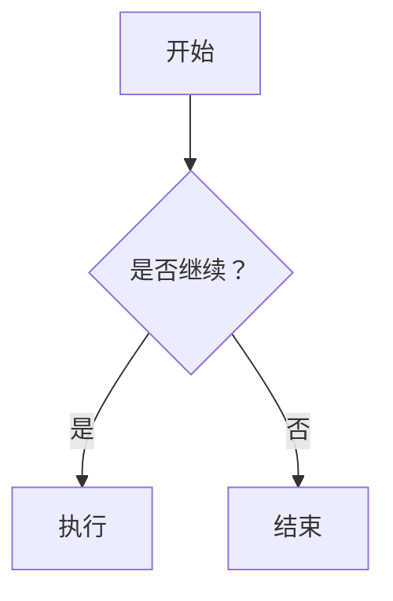

# Markdown 部分语法展示

## 文本样式

- **粗体**：`**粗体**` 或 `__粗体__`
- _斜体_：`*斜体*` 或 `_斜体_`
- **_粗斜体_**：`***粗斜体***`
- ~~删除线~~：`~~删除线~~`
- <u>下划线</u>：使用 HTML 标签 `<u>`
- 行内代码：`console.log("Hello")`
- 上标：X<sup>2</sup>，下标：H<sub>2</sub>O
- 标记高亮（GFM）：`==高亮==` 需要渲染器支持，这里用 `<mark>` 替代：<mark>高亮</mark>

## 链接

- [内联链接](https://example.com)
- [带标题的链接](https://example.com "示例网站")
- 引用式链接：这是 [一个引用链接][ref]，稍后定义。
  [ref]: https://example.com "可选标题"
- 自动链接：<https://example.com> 或 <email@example.com>

## 图片


## 列表

### 无序列表

- 一级项目
  - 二级项目（缩进两个空格或一个制表符）
    - 三级项目
- 另一个一级项目

### 有序列表

1. 第一项
2. 第二项
   1. 第二项的子项（缩进两个空格或一个制表符）
   2. 另一个子项
3. 第三项

### 任务列表（GFM）

- [x] 已完成任务
- [ ] 未完成任务
- [ ] 子任务缩进
  - [x] 子任务已完成

## 引用

> 一级引用
>
> > 嵌套引用
> >
> > > 三级引用
>
> 返回一级引用

引用内可以包含其他 Markdown 元素，如 **粗体** 或 `代码`。

## 代码块

### JavaScript

```javascript
function fibonacci(n) {
  if (n <= 1) return n;
  return fibonacci(n - 1) + fibonacci(n - 2);
}
```

### CSS

```css
.container {
  display: grid;
  grid-template-columns: repeat(auto-fill, minmax(300px, 1fr));
  gap: 24px;
}
```

### Python

```python
def fibonacci(n):
    if n <= 1:
        return n
    return fibonacci(n - 1) + fibonacci(n - 2)
```

### 其他语言（Bash/JSON）

```bash
echo "Hello, world!"
```

```json
{
  "name": "Markdown",
  "version": 1.0
}
```

## 表格

| 左对齐     |  居中对齐  |   右对齐 |
| :--------- | :--------: | -------: |
| 单元格1    |  单元格2   |  单元格3 |
| 长内容示例 | 又一些内容 | ￥123.45 |
| 空单元格   |            |     默认 |

## 水平分割线

---

## 脚注

这里需要脚注的例子[^1]，还可以有多个脚注[^2]。

[^1]: 这是第一个脚注的内容。

[^2]:
    第二个脚注，可以包含多行。  
    第二行内容。

## HTML 标签

- 键盘按键：<kbd>Ctrl</kbd> + <kbd>C</kbd>
- 换行（HTML 的 `<br>`）：第一行<br>第二行
- 注释：<!-- 这是 HTML 注释，不会显示 -->

## 转义字符

使用反斜杠转义特殊字符：\*不是斜体\*，\# 不是标题，\[不是链接\]，\`不是代码\`

## 表情符号（Emoji）

支持直接输入或使用短代码（需渲染器支持）：
:smile: :heart: :rocket:  
也可以直接输入：😊 ❤️ 🚀

## 定义列表

<dl>
  <dt>术语一</dt>
  <dd>定义内容，缩进后跟冒号。</dd>
  <dt>术语二</dt>
  <dd>第二个定义。</dd>
  <dd>第二个定义的另一个段落。</dd>
</dl>

## 引用式链接的完整示例

前面已经使用了 [ref] 和脚注，这里再展示一个图片引用链接：

![引用图片][image-ref]

[image-ref]: /favicon.svg "通过引用定义的图片"

## 目录（自动生成）

部分渲染器支持 `[TOC]` 或 `<!-- toc -->` 来自动生成目录：

[TOC]

> 注意：不是所有平台都支持，可手动编写锚点链接替代。

## 锚点 / 页内跳转

使用 HTML 的锚点标签或 Markdown 的标题自动 ID（如 `#标题`）：

[跳转到文本样式](#文本样式)

实际效果：[跳转到文本样式](#文本样式)（如果标题的 ID 为“文本样式”）

## 数学公式（LaTeX）

许多 Markdown 渲染器（如 Typora、Jupyter、GitHub 支持数学）可通过 `$` 或 `$$` 包裹 LaTeX 代码：

- 行内公式：$E = mc^2$
- 块级公式：

$$
\int_{-\infty}^{\infty} e^{-x^2} dx = \sqrt{\pi}
$$

## 图表（Mermaid）

Mermaid 是流行的图表语法，支持流程图、时序图、甘特图等：



渲染效果会显示流程图。

## GitHub 风格的提示框（Alerts）

GitHub Markdown 支持特殊的引用块作为提示（Note、Warning、Important 等）：

> [!NOTE]
> 这是一个提示信息。

> [!WARNING]
> 这是一个警告。

> [!IMPORTANT]
> 重要内容，请注意。

## 缩写（Markdown Extra）

使用 HTML 的 `<abbr>` 标签实现：

<abbr title="超文本标记语言">HTML</abbr> 和 <abbr title="层叠样式表">CSS</abbr>

## 任务列表嵌套对齐

- [ ] 外层任务
  - [x] 内层已完成
  - [ ] 内层未完成

## 段落内换行

在行末添加两个空格，然后回车，可实现换行而不分段。  
例如这一行前面有两个空格。

## HTML 原生元素的高级用法

- 音频/视频：`<audio src="..." controls>`
- 进度条：`<progress value="70" max="100">70%</progress>`
- 折叠块（details）：

<details>
  <summary>点击展开</summary>
  这里是隐藏内容。
</details>
